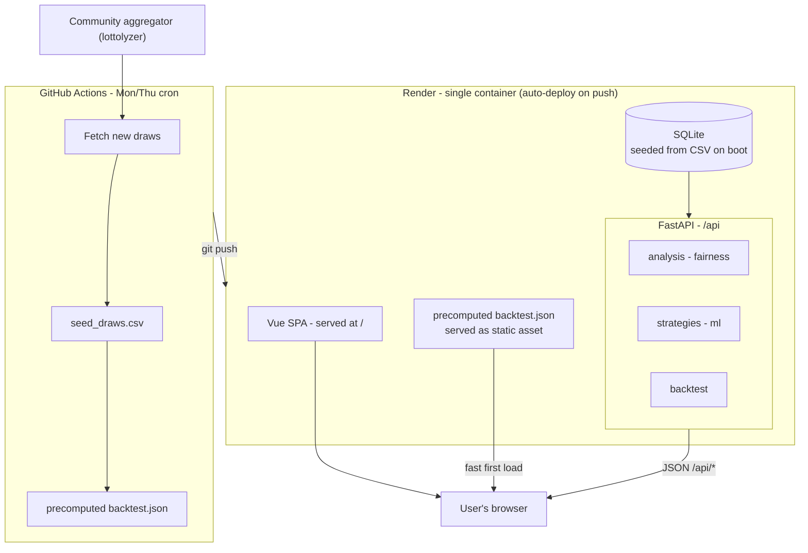

# Toto.Lab — Singapore Toto Analysis & (Honest) Prediction

A full-stack data-analysis app for Singapore Toto (6/49). It ingests real draw
history, computes genuine statistics, generates number picks with several
strategies (including machine learning), and — the honest centrepiece —
**backtests every strategy against a random baseline to prove that none of them
beats chance.**

> ⚠️ **For entertainment only.** Toto draws are independent random events. No
> method can predict future draws better than chance. Jackpot odds are
> **1 in 13,983,816** and the expected value of a ticket is negative. This
> project exists to *analyse* and to *demonstrate*, not to beat the lottery.

## Why it's built this way

"Predicting" a fair lottery is impossible, so the interesting engineering problem
is doing the analysis **honestly**:

- Every prediction strategy is measured with a **walk-forward backtest** (train on
  the past, predict the next draw, score the hit) so there is no future leakage.
- Strategies are compared to the **theoretical random expectation** (a random
  6/49 ticket matches `6 × 6/49 ≈ 0.735` of the drawn numbers on average) with a
  proper significance test and a Bonferroni correction for testing several
  strategies at once.
- Independent **fairness tests** (chi-square uniformity, runs test, autocorrelation)
  confirm the draw behaves like an unpredictable random process.

## Architecture

<!-- Rendered by GitHub. Source: img/architecture.mmd -->



Diagram source: [`img/architecture.mmd`](img/architecture.mmd).

Data source note: results are read from a **community aggregator**, not scraped
from Singapore Pools directly (their Terms of Service prohibit scraping). The
dataset is tiny (~1,250 draws in the current 6/49 era) and grows only twice a
week, so a polite scheduled refresh is plenty. The slow walk-forward backtest is
**precomputed** into `frontend/public/precomputed/backtest.json` (regenerated by
the refresh workflow) so the Reality Check page loads instantly.

## Project layout

- `backend/` — FastAPI app, analysis modules, tests, bundled seed CSV.
- `frontend/` — Vue 3 single-page app (Explore, Predictions, Reality Check, Data).
- `Dockerfile` — single container that builds the SPA and serves it with the API.
- `docker-compose.yml` — run that container locally.

## Run it locally

### Option A — Docker (one command, production-like)

Builds the single container (SPA + API) and serves everything from one origin:

```bash
docker compose up --build
# app + API + docs: http://localhost:8010  (docs at /docs)
```

### Option B — two terminals (best for frontend development, with hot-reload)

Backend:

```bash
cd backend
python -m venv .venv
.venv/Scripts/python -m pip install -r requirements.txt   # Windows
# source .venv/bin/activate && pip install -r requirements.txt  # macOS/Linux
.venv/Scripts/python -m uvicorn app.main:app --port 8010
```

Frontend:

```bash
cd frontend
npm install
npm run dev        # http://localhost:5173  (proxies /api -> :8010)
```

On first start the backend seeds SQLite from `backend/data/seed_draws.csv`
(600 real draws, 2020–2026). The API is served under `/api`; in production the
same FastAPI process also serves the built SPA at `/`.

> If port 8010 is taken, pick another and update the Vite proxy target in
> `frontend/vite.config.js`.

## Key API endpoints

All under `/api`:

| Endpoint | What it returns |
|---|---|
| `GET /api/draws` · `/api/draws/latest` | Raw draw history |
| `GET /api/stats/frequency` `/gaps` `/pairs` `/sums` `/oddeven` `/repeats` `/consecutive` `/waittime` | Descriptive stats |
| `GET /api/stats/number/{n}` | Everything about one number |
| `GET /api/fairness` | Randomness tests + verdicts |
| `GET /api/predict?strategy=all&count=6&sets=1` | Picks per strategy (count = 6–12, sets = 1–10) |
| `GET /api/backtest?test_size=150` | Walk-forward results vs random |

Interactive docs at `/docs`.

## The views

1. **Explore** — one page, three sections: *Overview* (latest draw, headline
   stats, frequency chart), *Patterns* (pair heatmap, sums, odd/even, repeats
   from previous draw, consecutive numbers, wait-time distribution), and
   *Number explorer* (per-number stats, rolling appearance rate, partners).
2. **Predictions** — one pick per strategy; choose 6–12 numbers per set (Toto
   System bets) and how many sets to generate; regenerate on click.
3. **Reality Check** — the honest showcase: walk-forward backtest with confidence
   intervals against the random baseline, plus fairness tests.
4. **Data** — searchable raw draw history.

## Prediction strategies

`random` (baseline), `frequency` (hot), `cold` (rarely drawn), `overdue` (due),
`markov` (conditional co-occurrence), `contrarian` (numbers above 31 that players
avoid — the only strategy with a real, payout-sharing rationale), and `ml`
(gradient boosting). Each is an independent weighted sample; the backtest shows
none beats random.

## Tests

```bash
cd backend
.venv/Scripts/python -m pytest -q
```

Covers ingest/upsert idempotency, hand-checked statistics, strategy validity,
fairness math against SciPy, and — importantly — that the backtest never leaks
future data.

## Deployment

Everything ships as **one container** (`Dockerfile`): a Node stage builds the
SPA, a Python stage serves it plus the API from a single origin.

**Render** (`render.yaml` blueprint): New → Blueprint → pick this repo. Render
builds the Dockerfile and auto-deploys on every push — that's the CI/CD. Health
check is `/api/health`.

**Data refresh — GitHub Actions, not an in-process scheduler.** Free-tier
container storage is ephemeral (SQLite resets on redeploy), so the committed
`backend/data/seed_draws.csv` is the source of truth. The workflow in
`.github/workflows/refresh-data.yml` runs Mon/Thu, fetches new draws, commits the
updated CSV, and Render redeploys and reseeds automatically. The in-process
APScheduler is disabled in the container (`TOTO_DISABLE_SCHEDULER=1`) and only
runs for always-on/local setups.
